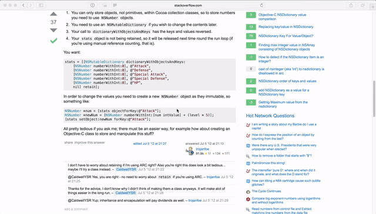

# PinShot

*Capture the screen and make it floating for temporary reference.*

&nbsp;&nbsp;&nbsp;&nbsp;&nbsp;&nbsp;[](https://raw.githubusercontent.com/JeziL/IPASearch/master/LICENSE)

For the situation where you cannot copy or don't need to copy something. Like coding referring to a snippet of code on a webpage, or typing some text in a picture someone sent to you.

Inspired by the jailbreak tweak [Snapper 2](http://moreinfo.thebigboss.org/moreinfo/depiction.php?file=snapper2Dp) on iOS.



See the introduction video [here](https://www.youtube.com/watch?v=ZoK7RrghvK0).

## Features

- Start with global shortcut or menubar icon
- Always floating on the very top
- Drag to resize
- Scroll to adjust opacity
- Right click to save
- Double click to dismiss

## How to Build

The pods directory is **not** included in the repo so you need to run `pod install` manually:

```
git clone https://github.com/JeziL/PinShot.git
cd PinShot
pod install
open PinShot.xcworkspace
```

If you don't have [CocoaPods](https://cocoapods.org/) installed, [install it](https://guides.cocoapods.org/using/getting-started.html#installation).

## With Special Thanks to

- [Snapper 2](http://moreinfo.thebigboss.org/moreinfo/depiction.php?file=snapper2Dp)
- [MASShortcut](https://github.com/shpakovski/MASShortcut)
- [WTScreenCapturer](https://github.com/Naituw/WTScreenCapturer)

